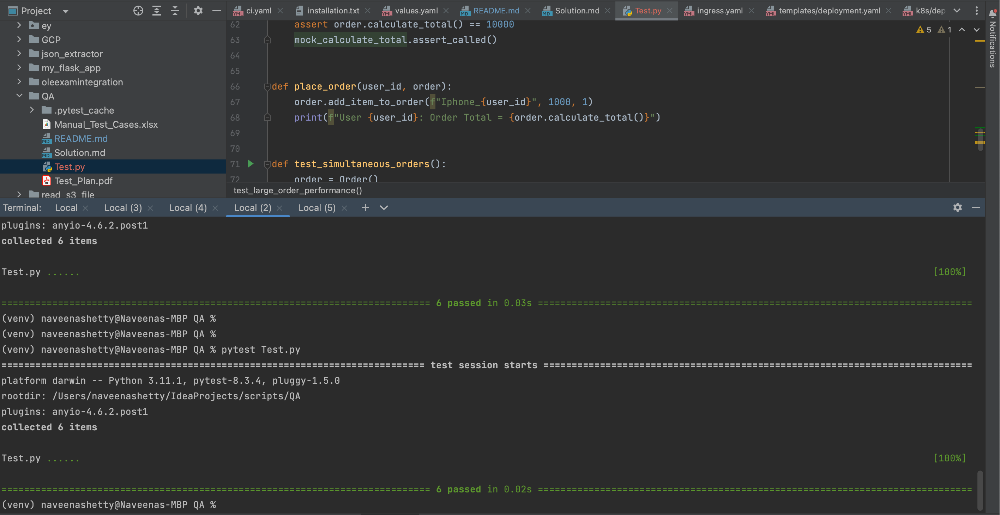

# Project Repository

This repository contains solutions for the tasks provided, along with manual test cases in an Excel file. Below is a brief explanation of the files in this repository.
**Note: Because of privacy concern I did not mention task details in the repo or in the solution rather mentioned assignment 1 and 2.**
## Files in the Repository


### 1. **Test_Plan**
- This file contains high level test plan.
- It includes detailed explanations with each stage.

### 2. **Solutions.md**
- This file contains all the solutions for the tasks provided.
- It includes detailed explanations, code snippets, related to the tasks.

### 3. **Manual_Test_Cases.xlsx**
- This file contains the manual test cases for the provided tasks.
- It includes test high level test plan, Test cases,expected results.

### 4. **Test.py**
- This file contains the python test cases with mocked Order class and its data
- This is not something real logic rather just mocked it
- Install required python version and pytest lib.
- To execute use pytest Test.py 
- 

## How to Use

- Open the `Solutions.md` file to view the task solutions and corresponding explanations.
- For manual testing, open the `Manual_Test_Cases.xlsx` file and follow the test cases to verify the functionality of the provided solutions.
- For Test plan open the `Test_Plan.pdf`
- For Automated Test case open `Test.py`

## Getting Started

1. Clone this repository to your local machine:

   ```bash
   git clone git@github.com:naveenshetty/QA.git
